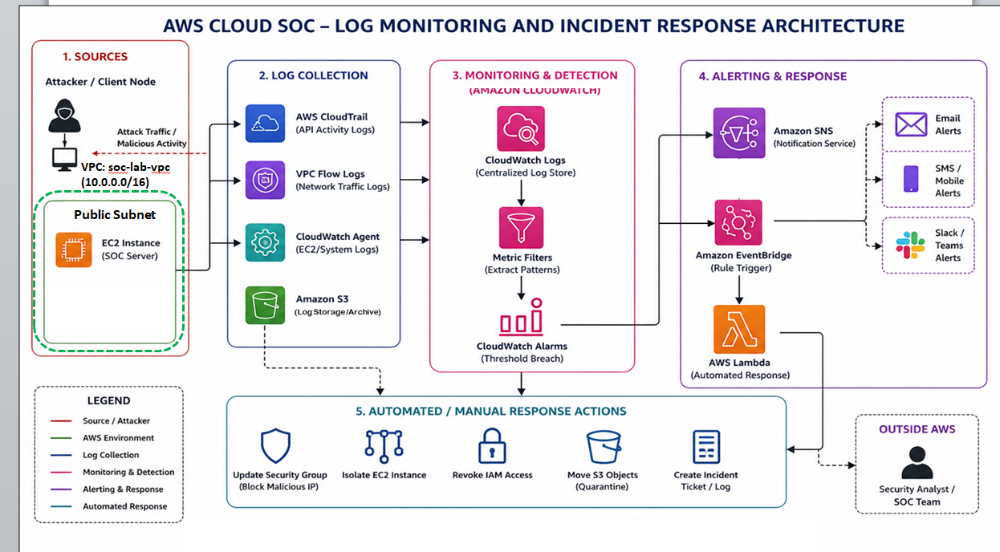
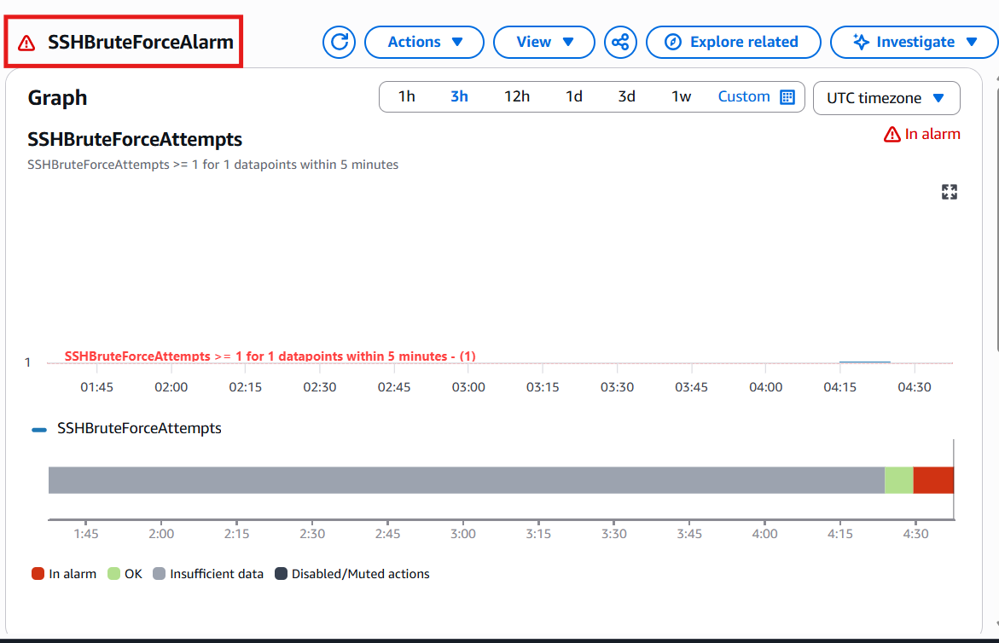

# AWS Cloud SOC – Log Monitoring and Incident Response

**Design and Implementation of a Cloud SOC Environment for Log Monitoring and Incident Response (AWS)**

A cloud-native Security Operations Center (SOC) built using AWS to detect, analyze, and respond to real-time security threats without relying on traditional SIEM solutions.


---

## Project Overview

This project demonstrates how AWS native services can be integrated to build a lightweight SOC capable of multi-layer threat detection and automated incident response.

The system collects logs from API, network, and host levels, analyzes them using Amazon CloudWatch, and triggers alerts and response actions through AWS Lambda and EventBridge.

---

## Key Features

- Multi-layer detection (API, Network, Host)
- Real-time alerting using CloudWatch and SNS
- Automated incident response using AWS Lambda
- Simulation of 7 real-world cyber attacks
- Centralized logging across AWS services
- NIST SP 800-61 based incident response workflow

---

## Architecture

The architecture illustrates the end-to-end SOC pipeline from attack detection to response.

Logs are collected from multiple AWS sources, processed using CloudWatch, and used to trigger alerts and automated remediation actions.



---

## Detection and Response Workflow

Attack → Log Collection → Detection (Metric Filters) → Alert (CloudWatch Alarm + SNS) → Response (Lambda / Manual)

---

## AWS Services Used

- Amazon EC2 (SOC Server)
- Amazon VPC (Network Isolation)
- AWS CloudTrail (API Activity Monitoring)
- VPC Flow Logs (Network Traffic Monitoring)
- Amazon CloudWatch (Log Monitoring & Alarms)
- Amazon SNS (Alert Notifications)
- AWS Lambda (Automated Response)
- Amazon EventBridge (Event Triggering)
- Amazon S3 (Log Storage & Archival)
- AWS IAM (Access Control)

---

## Attack Scenarios Simulated

1. Unauthorized SSH Access
2. SSH Brute Force Attack
3. Port Scanning Attack
4. Security Misconfiguration (Public SSH Access)
5. SYN Flood / DoS Simulation
6. Suspicious API Activity (IAM Privilege Escalation)
7. Data Exfiltration (S3 GetObject)

---

## Log Sources

* CloudTrail → API-level logs
* VPC Flow Logs → Network-level logs
* CloudWatch Agent → OS-level logs (`/var/log/secure`)

---

## Multi-layer Detection Strategy

This project uses a layered detection approach:

* API Layer → AWS CloudTrail
* Network Layer → VPC Flow Logs
* Host Layer → CloudWatch Agent logs

This ensures comprehensive visibility across the cloud environment.

---

## Detection Mechanism

- Logs are stored in CloudWatch Log Groups  
- Metric Filters detect suspicious patterns such as:

  - `REJECT` → Blocked traffic  
  - `REJECT AND TCP` → Port scanning  
  - `Failed password` → SSH brute force  
  - `AttachUserPolicy` → IAM misuse  
  - `GetObject` → S3 data access  

- CloudWatch Alarms trigger alerts when thresholds are exceeded  

---

## Alerting

Alerts are generated using Amazon SNS:

- Email notifications  
- Optional SMS or integrations  

---

## Automated Response

Automated response is implemented using AWS Lambda and EventBridge to quickly contain threats.

See: [Lambda Function Code](automation/lambda/soc-auto-block.py)

### Example Actions

- Remove insecure SSH access (`0.0.0.0/0`)
- Block malicious IP addresses
- Update security group rules

---

## 🔍 Example: SSH Brute Force Detection

- Logs collected from `/var/log/secure`
- Metric filter detects `"Failed password"`
- CloudWatch alarm triggers alert
- Lambda automatically blocks attacker IP

This demonstrates real-time detection and automated containment.

## Detection Evidence



This screenshot shows the CloudWatch alarm triggered when multiple failed SSH login attempts were detected, indicating a brute force attack.

---

## Manual Response

Manual actions include:

- Revoking IAM permissions  
- Investigating suspicious API activity  
- Restricting S3 access  
- Performing validation and verification
  
---

## Incident Response Framework

This project follows:

**NIST SP 800-61 (Computer Security Incident Handling Guide)**

Phases:

1. Preparation  
2. Detection & Analysis  
3. Containment  
4. Eradication & Recovery  
5. Post-Incident Activity  

---

## Skills Demonstrated

- AWS Cloud Security  
- Security Monitoring & Log Analysis  
- Incident Response (NIST Framework)  
- Threat Detection using CloudWatch  
- Automation using AWS Lambda & EventBridge  

---

## Sample Detection Evidence

Screenshots available in the `screenshots/` folder include:

- Attack simulations  
- CloudWatch alarms  
- SNS alerts  
- Automated response validation
  
---

## Limitations

- Automated response is rule-based (not adaptive)  
- No full SIEM integration  
- Limited advanced threat correlation  

---

## Future Improvements

- Implement dynamic automated response  
- Integrate AWS GuardDuty  
- Add SIEM tools (Splunk / Microsoft Sentinel)  
- Apply behavior-based anomaly detection  
- Develop automated response playbooks  

---

## Project Structure

```text

cloud-soc-incident-response-aws/
├── architecture/
├── screenshots/
├── lambda-code/
├── commands/
├── report/
└── README.md
```

---

## Author

**Farhana Ahmed**

Cybersecurity Graduate – Centennial College

 GitHub: https://github.com/Farhana330/cloud-soc-incident-response-aws
